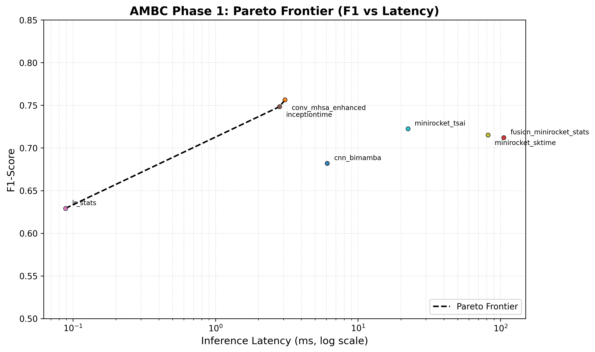

# AMBC

**A**viation **M**aintenance **B**inary **C**lassification

> An *unofficial* benchmark on the NGAFID aviation maintenance dataset (pre- vs post-maintenance binary classification).  
> Built as a lab qualifying task, kept as a reference for future reproducers.

---

## What is this?

A minimal, audit-oriented benchmark for binary flight classification on the NGAFID dataset (Yang & Desell, 2022). Instead of chasing best performance, AMBC asks: **"If all models hit the same accuracy ceiling, what differentiates them?"**

**Task**: Binary classification — flights before maintenance (label 0) vs after (label 1).  
**Data**: NGAFID Section 3.2 benchmark subset (19 maintenance event types, 5-fold CV).  
**Focus**: Reproducibility auditing, lightweight architecture evaluation, and the **performance-efficiency Pareto frontier**.

See `evaluation_protocol.md` for the full standard.

---

## Phase 1: Done (2026-07)

**Scope**: Audit existing community reproductions + establish a runnable cross-model pipeline.

**Key findings**:
- **Accuracy ceiling**: ~0.75–0.76 F1. All mainstream architectures (CNN, Transformer, Rocket, Mamba) converge here; differences are mostly noise.
- **Efficiency is the real signal**: Latency spans 3 orders of magnitude (0.1 ms to 100+ ms) with negligible F1 gaps.
- **Official MiniRocket bug found**: The original Colab (Yang et al.) passes untransposed dimensions `(N, 4096, 23)` to `MiniRocketFeatures`, causing a 13-point accuracy drop. Corrected implementation lands at ~0.72, not 0.60.
- **BiMamba underperforms**: Despite the hype, CNN+BiMamba is dominated by both CNN-only and MiniRocket under the standard protocol (no sliding-window tricks).

### Standard Track — Phase 1 Results

| # | Model | F1 | Acc. | Latency (ms) | GPU Mem (MB) | Notes |
|---|-------|------|------|--------------|--------------|-------|
| 1 | conv_mhsa_enhanced | 0.7564 ± 0.0090 | 0.7594 ± 0.0047 | 3.073 ± 0.108 | — | BN+PosEnc+GELU+CosineLR ablation |
| 2 | inceptiontime | 0.7484 ± 0.0088 | 0.7485 ± 0.0073 | 2.812 ± 0.048 | — | PyTorch port from TF/TPU |
| 3 | minirocket_tsai | 0.7225 ± 0.0158 | 0.7292 ± 0.0156 | 22.404 ± 0.229 | 143.4 | GPU-accelerated |
| 4 | minirocket_sktime | 0.7153 ± 0.0091 | 0.7223 ± 0.0117 | 81.725 ± 22.132 | — | CPU-only |
| 5 | fusion_minirocket_stats | 0.7121 ± 0.0082 | 0.7189 ± 0.0113 | 105.216 | — | MiniRocket + hand-crafted stats |
| 6 | cnn_bimamba | 0.6820 ± 0.1117 | 0.7063 ± 0.0397 | 6.086 ± 0.517 | 145.6 | High variance; not recommended |
| 7 | lr_stats | 0.6292 ± 0.0082 | 0.6337 ± 0.0078 | 0.089* | — | *Latency excludes feature extraction; to be re-measured in Phase 2 |

**Interpretation**: The frontier is flat. You can get ~0.75 F1 with 3 ms latency (ConvMHSA), or ~0.71 F1 with 80 ms latency (MiniRocket CPU). The choice is not "which is more accurate" but "how much latency are you willing to pay for marginal F1 gains."

---

## Phase 2: Planned (TBD)

- [ ] Re-measure `lr_stats` with end-to-end latency (feature extraction included).
- [ ] Add Precision, AUC-ROC, and wall-clock training time to the metric suite.
- [ ] Unified virtual environment (currently a mix of Windows PyTorch, WSL2, and sktime/tsai).
- [ ] Audit remaining candidates: complex paper architectures and incomplete Kaggle implementations.
- [ ] Optional: ResNet-1D, micro-Transformer, or other lightweight architectures.

---

## Maintenance Policy

**AMBC is not a living benchmark.** The NGAFID maintenance dataset is a valuable *real-world* resource, but its binary classification task has a hard accuracy ceiling (~0.75) imposed by coarse labels and high pilot-induced variance. It is unlikely to become a "second CWRU" for the TSC community.

**Therefore:**
- No active state of the art chasing.
- No guaranteed long-term maintenance.
- **But**: The audit trail (bug reports, protocol definitions, hardware notes) is kept as a reference for anyone reproducing this dataset in the future.

If you are a future reproducer hitting weird results, check the `audit/` folder and the notes above before blaming your model.

---

## Quick Reference

| Item | Detail |
|------|--------|
| Dataset | NGAFID Aviation Maintenance Dataset |
| Official source | Zenodo DOI: 10.5281/zenodo.6624956 |
| Sensors | 23 channels, 1 Hz, truncated/padded to 4096 steps |
| Size | ~11k flights (2-day subset), 23 sensors |
| Preprocessing | Per-channel MinMax, NaN → 0, no data augmentation |
| Evaluation | 5-fold CV, flight-level (no sliding-window tricks) |
| Primary metric | F1-score (binary) |
| Efficiency metric | Inference latency per flight (ms) |

---

## Citation / Acknowledgment

If you use AMBC's protocol or findings, cite the original dataset:

> Yang, H., & Desell, T. (2022). *A Large-Scale Annotated Multivariate Time Series Aviation Maintenance Dataset from the NGAFID*. arXiv:2210.07317.

And maybe drop a note that you found this via an unofficial audit. We like audit trails.

---

*Created for a lab qualifying task. Not an official benchmark — just an honest one.*